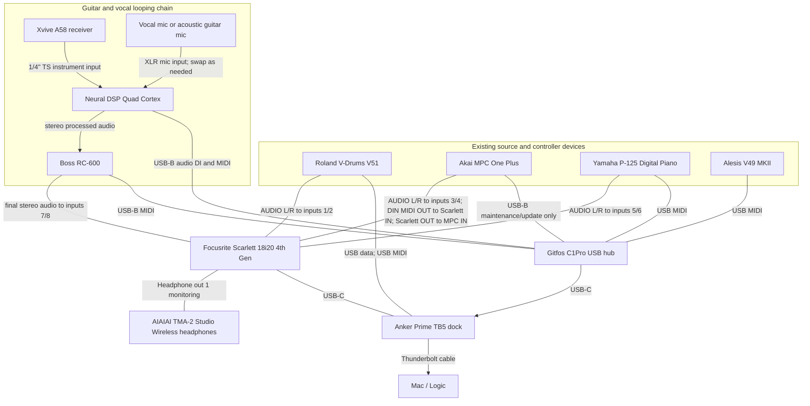
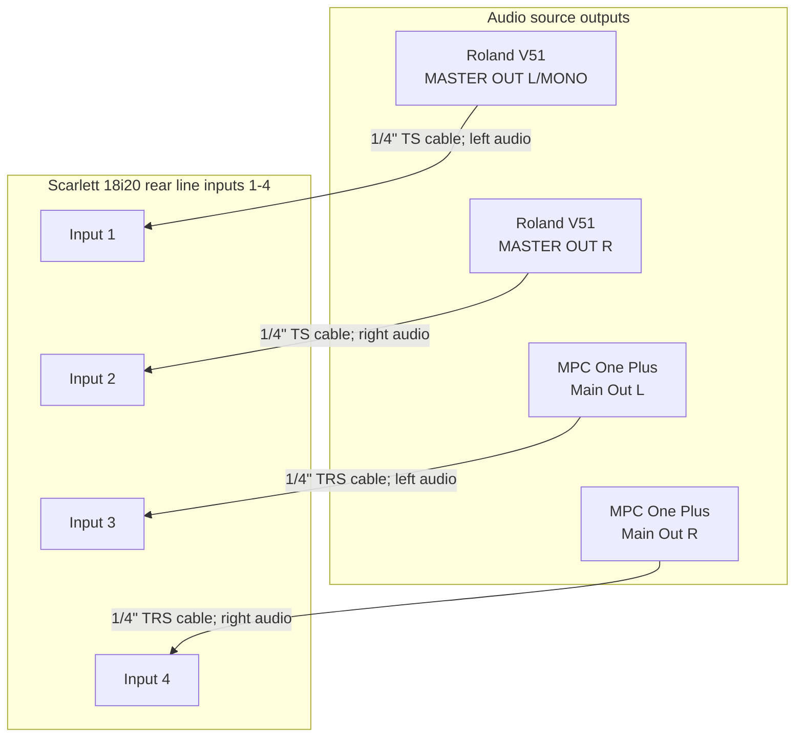
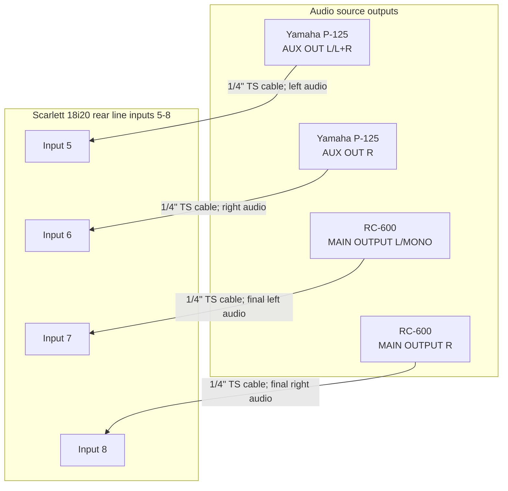
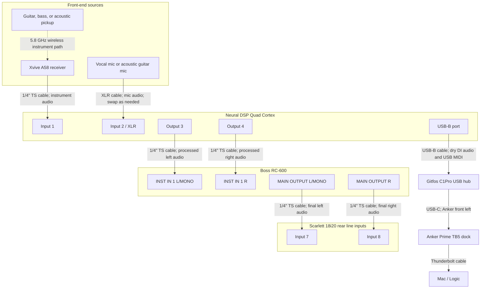
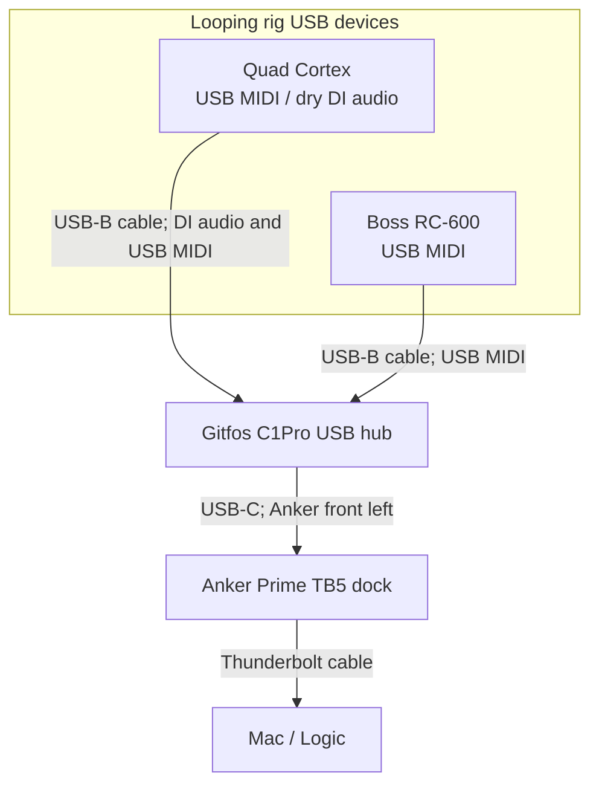
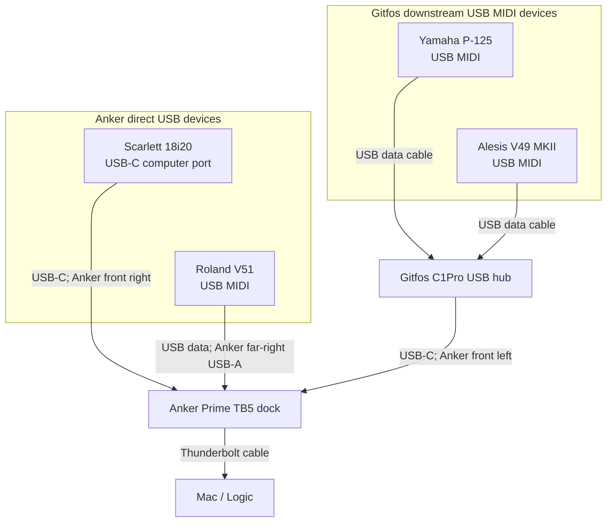
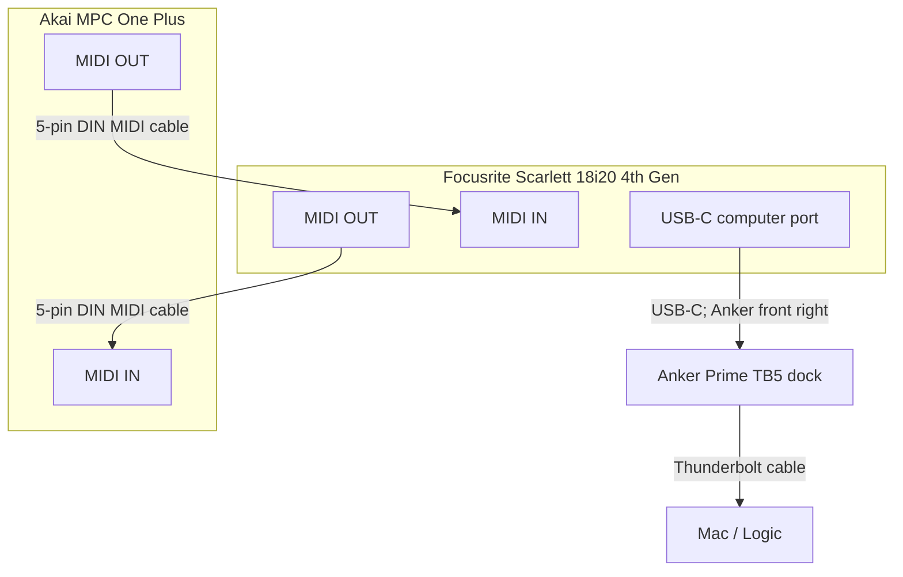
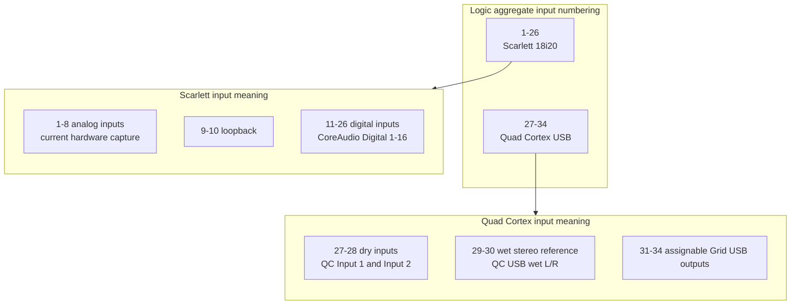
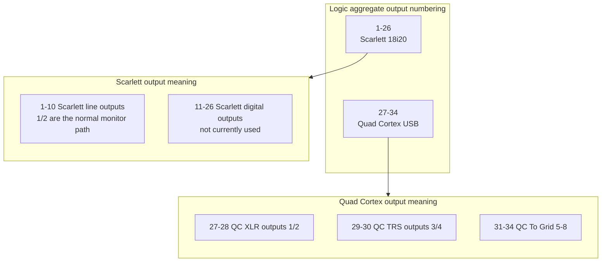

# Music Studio Setup

This file captures the working studio hardware context for future Codex sessions in this folder.

## Documentation Rules

- In detailed Mermaid connection diagrams, every physical cable must have its own line/edge. Do not combine stereo pairs, paired line outputs, or USB chains into a single diagram edge. Topology diagrams are the exception: they may aggregate connection roles into a single device-to-device edge.
- Diagram edge labels must specify the cable type, such as `1/4" TRS cable`, `5-pin DIN MIDI cable`, or `USB-C cable`, rather than generic labels like `audio cable` or `USB cable`.
- Internal device routing may be shown, but it must be labeled as internal routing rather than as a cable.
- Preserve physical device identity in diagrams. Do not collapse multiple devices into a generic `Input devices` box just to make layout easier.
- Keep stereo pairs visually grouped within their actual device, but still draw one cable edge per left/right connection.
- Preferred diagram layout: input/source devices on the top row, the primary interface/mixer alone on the middle row, and monitoring/USB/computer destinations on the bottom row.
- If a bidirectional MIDI loop causes Mermaid to make a bad horizontal layout, use an undirected edge for one physical MIDI cable rather than flattening device structure.
- Use `USB MIDI` consistently for USB ports carrying MIDI. Use the cable label to distinguish the physical cable type. Keep non-MIDI USB roles explicit, such as `USB-B maintenance`.

## Device Summary

### Boss RC-600

- Role: Loop station / phrase looper for guitar, vocals, and external instrument capture.
- Folder: `Boss RC-600`
- Main manuals: `Boss RC-600/RC-600_eng05_W.pdf`, `Boss RC-600/RC-600_Parameter_eng04_W.pdf`
- Installed Mac software: BOSS TONE STUDIO for RC 1.5.0, RC Rhythm Converter 1.0.1, and RC-600 Driver 1.0.1.
- System program archive: `Boss RC-600/system-program/rc600_sys_v150.zip` for RC-600 System Program 1.50.
- Driver note: The RC-600 driver requires the RC-600 `SYSTEM > USB > AUDIO` setting to be `VENDOR`; the installer reports that macOS must be restarted after installation.
- Update note: The system program is firmware for the RC-600 itself; check the unit version before applying it, and copy the extracted files to the RC-600 while it is booted in update mode.
- Current audio path: Quad Cortex outputs 3/4 feed the RC-600 INST IN 1 L/MONO and R jacks; RC-600 MAIN OUTPUT L/R feeds Scarlett 18i20 rear line inputs 7/8.
- Cable approach: Use two separate 1/4" TS cables from Quad Cortex outputs 3/4 to RC-600 INST IN 1 L/R, and two separate 1/4" TS cables from RC-600 MAIN OUTPUT L/R to Scarlett inputs 7/8.
- Current MIDI path: Use RC-600 USB-B MIDI to the Mac through the Gitfos hub, then through the Anker Prime TB5 dock. Logic should be the default MIDI clock/transport master for RC-600 loop quantize and rhythm sync.
- Routing note: The RC-600 is downstream of the Quad Cortex by default so the Boss captures the fully effected Cortex sound. Do not place the RC-600 in the Quad Cortex send/return loop unless intentionally building a special preset that needs Cortex effects after the looper.

### Neural DSP Quad Cortex

- Role: Guitar/bass digital amp modeler, multi-effects floorboard, profiler/capture device, and USB audio/MIDI-capable hardware unit.
- Folder: `Neural DSP Quad Cortex`
- Main docs: `Neural DSP Quad Cortex/docs/Quad Cortex User Manual 4.0.0.pdf`, `Neural DSP Quad Cortex/docs/Quad Cortex Device List 2026-01-21.pdf`
- Saved web docs: `Neural DSP Quad Cortex/docs/Quad Cortex User Manual 4.0.0.html`, `Neural DSP Quad Cortex/docs/Quad Cortex Device List 2026-01-21.html`, `Neural DSP Quad Cortex/docs/Neural DSP User Manuals support page 2026-02-12.html`
- Mac software archive: `Neural DSP Quad Cortex/software/Cortex Control v4.0.1.pkg`
- Inventory serial: `QA00AN529`
- USB audio note: The user manual describes Quad Cortex as USB Audio Class 2.0 compliant with 16 channels, 8 in / 8 out, fixed at 48 kHz.
- MIDI note: The device has 5-pin DIN MIDI IN and THRU/OUT plus USB MIDI capability.
- Power note: The user manual lists 12V DC, 3A, center-negative power.
- Current input path: Xvive A58 receiver stays connected to Quad Cortex Input 1 for guitar, bass, or acoustic with pickup. Quad Cortex Input 2/XLR is the swap point for a vocal mic or acoustic guitar mic.
- Current output path: Quad Cortex outputs 3/4 feed the RC-600 INST IN 1 L/R pair in stereo. Use this instead of Quad Cortex XLR outputs into RC-600 XLR inputs because the RC-600 XLR inputs are mic inputs, not the normal line-level destination for the Cortex.
- Current USB path: Quad Cortex USB-B connects to the Gitfos C1Pro USB hub, then through the Anker Prime TB5 dock, for USB MIDI and dry DI capture into Logic. The normal Logic recording tracks should use Quad Cortex aggregate input channels 27/28 for dry inputs only, plus the RC-600 final stereo output from Scarlett inputs 7/8.
- Current MIDI path: Use Quad Cortex USB MIDI to the Mac through the Gitfos hub and Anker dock. Logic should be the default MIDI clock master for tempo-synced Cortex delays/modulation.

### Xvive A58 Guitar Wireless System

- Role: 5.8 GHz wireless guitar/bass/instrument system for replacing a 1/4" instrument cable between an instrument or pedal and an amp, amp modeler, pedalboard, or audio interface.
- Folder: `XVive A58 Guitar Wireless System`
- Manual: `XVive A58 Guitar Wireless System/Xvive-A58-Guitar-wireless-system-manual-V1.pdf`
- Product page: [Xvive A58 Guitar Wireless System](https://xvive.com/audio/product/a58-guitar-wireless-system/)
- System contents note: Complete systems include a transmitter, receiver, USB-C charging cable, and carry case.
- Audio note: The A58 uses 24-bit/48 kHz audio, less than 5 ms latency, six wireless channels, and 1/4" TS instrument connections.
- Pickup note: Supports passive and active pickups; active mode is enabled from the transmitter channel button.
- Power note: Transmitter and receiver are rechargeable over USB-C with up to 5 hours of battery life.
- Current path: Xvive A58 receiver feeds Quad Cortex Input 1 over a 1/4" TS instrument connection.

### Focusrite Scarlett 18i20 4th Gen

- Role: Primary Mac audio and MIDI interface for Logic.
- Folder: `Focusrite Scarlett 18i20 4th Gen`
- Manual: `Focusrite Scarlett 18i20 4th Gen/scarlett_18i20_4th_gen_user_guide_v3_en.pdf`
- Current use: Replaces both the Focusrite Saffire Pro 40 and the Focusrite Scarlett 4i4 as the single active Mac audio/MIDI interface.
- Roland V51 input pair: rear line inputs 1/2.
- MPC input pair: rear line inputs 3/4.
- Yamaha P-125 input pair: rear line inputs 5/6.
- RC-600 final stereo input pair: rear line inputs 7/8.
- MPC MIDI path: Scarlett 18i20 MIDI OUT to MPC MIDI IN, and MPC MIDI OUT to Scarlett 18i20 MIDI IN.
- Monitoring path: Headphone out 1 feeds the AIAIAI TMA-2 Studio Wireless headphones.
- USB path: Scarlett 18i20 USB-C computer port connects directly to the Anker Prime TB5 dock front right USB-C port, then the Anker dock connects to the Mac.
- Important constraint: No Scarlett 18i20 rear line output jacks are currently connected. Audio and MIDI go to the DAW over USB, and local monitoring uses Headphone out 1.
- Notes: Logic should use the Scarlett 18i20 4th Gen as the audio and MIDI device.

### Focusrite Scarlett 4i4

- Role: Superseded Mac audio interface retained for reference.
- Folder: `Focusrite Scarlett 4i4`
- Current use: Replaced by the Scarlett 18i20 4th Gen.
- Notes: Do not use this as the planned Logic audio device unless intentionally rolling back from the 18i20 setup.

### Focusrite Saffire Pro 40

- Role: Superseded standalone analog line mixer/pass-through device retained for reference.
- Folder: `Focusrite Saffire Pro 40`
- Manual: `Focusrite Saffire Pro 40/userguidepro40english04.pdf`
- Current use: Replaced by the Scarlett 18i20 4th Gen. FireWire is not part of the current setup.
- Important constraint: Do not assume Saffire MixControl, FireWire control, software routing changes, or programmable panning are available.

### Akai MPC One Plus

- Role: Standalone sampler/sequencer/groovebox and stereo audio source.
- Folder: `Akai MPC One Plus`
- Manual: `Akai MPC One Plus/MPC Standalone OS - User Guide - v3.9.pdf`
- Logic MIDI setup note: `Akai MPC One Plus/logic-midi-setup.md`
- Current audio path: MPC main left/right outputs feed Scarlett 18i20 rear line inputs 3/4.
- Cable approach: Use two separate 1/4" TRS cables for stereo, one for left and one for right. Short TS instrument cables can work if needed.
- Current MIDI path: Use the Scarlett 18i20 5-pin DIN MIDI In/Out loop with the MPC One Plus.
- USB maintenance path: MPC USB-B connects to the Gitfos C1Pro USB hub for updates/file maintenance only. Do not treat this USB cable as the active MIDI or audio path.

### Roland V-Drums V51

- Role: Drum sound module, stereo audio source, and USB MIDI source for Logic.
- Folder: `Roland V-Drums V51`
- Main manuals: `Roland V-Drums V51/V51_QuickStart_eng02_W.pdf`, `Roland V-Drums V51/V51_Reference_eng03_W.pdf`, `Roland V-Drums V51/V51_MIDI_Implementation_eng01_W.pdf`
- Current stereo audio path: V51 MASTER OUT L/MONO and R feed Scarlett 18i20 rear line inputs 1/2.
- Current USB MIDI path: V51 USB MIDI connects directly to the Anker Prime TB5 dock front far-right USB-A port, then the Anker dock connects to the Mac.
- Cable approach: Use two separate 1/4" TS cables for stereo audio, one for left and one for right. Use a USB data cable for USB MIDI.

### Yamaha P-125 Digital Piano

- Role: Digital piano, stereo audio source, and USB MIDI keyboard/controller for Logic.
- Folder: `Yamaha P-125 Digital Piano`
- Main manuals: `Yamaha P-125 Digital Piano/P-125 Owner's Manual.pdf`, `Yamaha P-125 Digital Piano/P-125 P-121 MIDI Reference.pdf`, `Yamaha P-125 Digital Piano/MIDI Basics.pdf`
- Current stereo audio path: Yamaha AUX OUT L/L+R and R feed Scarlett 18i20 rear line inputs 5/6.
- Current USB MIDI path: Yamaha USB MIDI connects to the Gitfos C1Pro USB hub, then through the Anker Prime TB5 dock to the Mac.
- Cable approach: Use two separate 1/4" TS cables for stereo audio, one for left and one for right. Use a USB data cable for USB MIDI.

### Alesis V49 MKII

- Role: USB MIDI keyboard controller for playing software instruments in Logic.
- Folder: `Alesis V49 MKII`
- Manual: `Alesis V49 MKII/V49 MKII - User Guide - v1.3.pdf`
- Current use: MIDI controller only; it does not provide audio to the Scarlett 18i20 or Logic.
- Current USB MIDI path: Alesis V49 MKII USB MIDI connects to the Gitfos C1Pro USB hub, then through the Anker Prime TB5 dock to the Mac.
- Cable approach: Use a USB data cable for MIDI only.
- Troubleshooting rule: Verify macOS sees the V49 MKII as a MIDI device before changing Logic track settings.

### Gitfos C1Pro USB Hub

- Role: USB-C hub/dock used for Mac connectivity.
- Folder: `Gitfos C1pro USB hub`
- Exact purchased hardware: Gitfos/Giftos 18-in-1 powered USB 3.2 USB-C hub with 4K HDMI, 100W PD, 45W charging, 10Gbps USB, SD/TF, audio, 65W adapter, 3.3 ft cable, aluminum body, and smart button.
- Model identifiers: Gitfos C1Pro, US-plug SKU `C1PRO-1`, Amazon ASIN `B0GGRPJT3X`.
- Home Inventory row: `INV-0037`.
- Purchase note: Amazon order `111-8180438-6170663`, ordered 2026-06-23, line-item price $71.99; Amazon email spells the brand as `Giftos`, while the saved vendor page and repo use `Gitfos`.
- Current use: Receives USB from the Quad Cortex, Boss RC-600, Alesis V49 MKII, Yamaha P-125, and MPC maintenance path, then connects to the Anker Prime TB5 dock front left USB-C port. Do not plug the Scarlett 18i20 or Roland V51 into the Gitfos in the current setup.
- Note: For MIDI controllers, a port can provide power while failing data negotiation. If a USB MIDI device lights up but does not appear in macOS, bypass the hub or move to a known-good data port.

### Anker Prime TB5 Docking Station

- Role: Thunderbolt 5 desktop docking station for workstation and USB-C/Thunderbolt expansion.
- Exact purchased hardware: Two Anker Prime TB5 Docking Stations, 14-in-1 Thunderbolt 5 docks with up to 120Gbps transfer, 140W max host charging, active cooling, up to 8K display support, and dual-display support for Thunderbolt 5/4 laptops.
- Model identifiers: Anker model `A83B5`, Amazon ASIN `B0DSVVJXK5`.
- Home Inventory row: `INV-0003`, quantity `2`.
- Purchase note: Amazon order `111-8180438-6170663`, ordered 2026-06-23, line-item price $309.99 each.
- Product page: [Anker Prime TB5 Docking Station](https://www.anker.com/products/a83b5-anker-prime-thunderbolt5-docking-station-14-in-1-140w-8k)
- Current setup note: The Anker dock is the Mac-facing hub for the active studio USB path. The Gitfos hub plugs into the Anker front left USB-C port, the Scarlett 18i20 plugs into the Anker front right USB-C port, and the Roland V51 plugs into the Anker front far-right USB-A port. All other documented USB studio devices currently plug into the Gitfos hub unless a specific port is documented later.

### AIAIAI TMA-2 Studio Wireless Headphones

- Role: Wireless monitoring headphones for the current Scarlett 18i20 setup.
- Current path: Scarlett 18i20 Headphone out 1.
- Source note: Identified from the Sweetwater recommendation for AIAIAI TMA-2 Studio Wireless headphones.

## Topology Diagram



## Audio Connections Diagram

These diagrams focus on the Scarlett rear-input capture paths. The dedicated looping-chain diagram below shows the Quad Cortex and RC-600 front-end details.

### Scarlett Inputs 1-4



### Scarlett Inputs 5-8



## Guitar / Vocal Looping Audio Diagram



## MIDI Connections Diagram

These MIDI diagrams are split by role so the USB clock/control paths and the MPC DIN loop stay readable.

### Looping Rig USB MIDI / DI



### Controller USB MIDI



### MPC DIN MIDI Loop



## Current Capture Path

Use this as the first tested path for capturing the current audio/MIDI setup in Logic:

```text
Roland V51 MASTER OUT L/MONO -- 1/4" TS cable -> Scarlett 18i20 rear line input 1
Roland V51 MASTER OUT R -- 1/4" TS cable -> Scarlett 18i20 rear line input 2

MPC One Plus MAIN OUT L -- 1/4" TRS cable -> Scarlett 18i20 rear line input 3
MPC One Plus MAIN OUT R -- 1/4" TRS cable -> Scarlett 18i20 rear line input 4

Yamaha P-125 AUX OUT L/L+R -- 1/4" TS cable -> Scarlett 18i20 rear line input 5
Yamaha P-125 AUX OUT R -- 1/4" TS cable -> Scarlett 18i20 rear line input 6

Xvive A58 receiver -- 1/4" TS cable -> Quad Cortex Input 1
Vocal mic or acoustic guitar mic -- XLR cable -> Quad Cortex Input 2/XLR (swap as needed)
Quad Cortex Output 3 -- 1/4" TS cable -> Boss RC-600 INST IN 1 L/MONO
Quad Cortex Output 4 -- 1/4" TS cable -> Boss RC-600 INST IN 1 R
Boss RC-600 MAIN OUTPUT L/MONO -- 1/4" TS cable -> Scarlett 18i20 rear line input 7
Boss RC-600 MAIN OUTPUT R -- 1/4" TS cable -> Scarlett 18i20 rear line input 8

MPC One Plus MIDI OUT -- 5-pin DIN MIDI cable -> Scarlett 18i20 MIDI IN
Scarlett 18i20 MIDI OUT -- 5-pin DIN MIDI cable -> MPC One Plus MIDI IN

Quad Cortex USB-B -- USB-B data cable -> Gitfos C1Pro USB hub -> Anker Prime TB5 dock front left USB-C port -> Mac -> Logic (dry DI audio on aggregate inputs 27/28, plus USB MIDI clock/control)
Boss RC-600 USB-B -- USB-B data cable -> Gitfos C1Pro USB hub -> Anker Prime TB5 dock front left USB-C port -> Mac -> Logic (USB MIDI clock/control; USB audio is available but not the default capture path)
Roland V51 USB MIDI -- USB data cable -> Anker Prime TB5 dock front far-right USB-A port -> Mac -> Logic
MPC One Plus USB-B -- USB-B data cable -> Gitfos C1Pro USB hub -> Anker Prime TB5 dock front left USB-C port -> Mac (updates/file maintenance only; not MIDI/audio)
Yamaha P-125 USB MIDI -- USB data cable -> Gitfos C1Pro USB hub -> Anker Prime TB5 dock front left USB-C port -> Mac -> Logic
Alesis V49 MKII USB MIDI -- USB data cable -> Gitfos C1Pro USB hub -> Anker Prime TB5 dock front left USB-C port -> Mac -> Logic

Scarlett 18i20 Headphone out 1 -- 1/4" TRS headphone cable -> AIAIAI TMA-2 Studio Wireless headphones

Scarlett 18i20 USB-C computer port -- USB-C cable -> Anker Prime TB5 dock front right USB-C port -> Mac -> Logic
Gitfos C1Pro USB-C hub output -- USB-C cable -> Anker Prime TB5 dock front left USB-C port -> Mac

No Scarlett 18i20 rear line output jacks are connected in this setup.

For Logic recording, use the Scarlett 18i20 as the primary audio interface and monitoring device. If using the macOS Aggregate Device to capture Quad Cortex dry DI over USB at the same time as the Scarlett, run the aggregate at 48 kHz and use aggregate input channels 27/28 for Quad Cortex dry input capture only. The final looped/effected performance is the RC-600 stereo output on Scarlett inputs 7/8.

For MIDI sync, use Logic as the default MIDI clock and transport master. Send MIDI clock/control to the Quad Cortex and RC-600 over USB MIDI. Keep the Scarlett 18i20 DIN MIDI loop reserved for the MPC One Plus unless intentionally testing a computerless DIN MIDI setup.
```

## Logic Aggregate Device Setup

Use this aggregate device when Logic needs to record the Scarlett 18i20 audio paths and the Quad Cortex USB dry DI paths at the same time.

- Current aggregate device name: `Scarlett 18i20 (1-26) + Quad Cortex (27-34)`.
- Current macOS state: 34 inputs / 34 outputs at 48 kHz.
- Device order: Scarlett 18i20 first, Quad Cortex second. This preserves the Scarlett's normal 1-26 numbering and puts the Quad Cortex at 27-34.
- Clocking: use the Scarlett 18i20 as the aggregate clock source, keep the aggregate at 48 kHz, and enable drift correction for the Quad Cortex if Audio MIDI Setup offers it.
- Do not add the Roland V51 to this aggregate for the current plan. The V51 audio is captured analog through Scarlett inputs 1/2, and its USB connection is for USB MIDI.
- In Logic, use aggregate inputs 7/8 for the final RC-600 stereo performance and aggregate inputs 27/28 for Quad Cortex dry DI safety tracks.
- For normal monitoring, use aggregate outputs 1/2 so playback stays on the Scarlett 18i20 monitoring/headphone path. Avoid aggregate outputs 27-34 unless intentionally sending DAW audio into the Quad Cortex for reamping or Grid processing.

### Aggregate Input Overview



### Aggregate Output Overview



### Aggregate Input Map

| Logic aggregate input | CoreAudio channel name | Current meaning |
| --- | --- | --- |
| 1 | Scarlett Input 1 | Roland V51 left audio |
| 2 | Scarlett Input 2 | Roland V51 right audio |
| 3 | Scarlett Input 3 | MPC One Plus left audio |
| 4 | Scarlett Input 4 | MPC One Plus right audio |
| 5 | Scarlett Input 5 | Yamaha P-125 left audio |
| 6 | Scarlett Input 6 | Yamaha P-125 right audio |
| 7 | Scarlett Input 7 | RC-600 final left audio |
| 8 | Scarlett Input 8 | RC-600 final right audio |
| 9 | Scarlett Loop 1 | Scarlett loopback 1 |
| 10 | Scarlett Loop 2 | Scarlett loopback 2 |
| 11-26 | Scarlett Digital 1-16 | Scarlett digital inputs; not used in the current capture path |
| 27 | Quad Cortex Dry Input 1 | Dry DI from Quad Cortex analog Input 1, normally Xvive/guitar |
| 28 | Quad Cortex Dry Input 2 | Dry DI from Quad Cortex analog Input 2, normally mic or second source |
| 29 | Quad Cortex Wet Signal L | Pre-RC-600 wet left reference; ignore by default |
| 30 | Quad Cortex Wet Signal R | Pre-RC-600 wet right reference; ignore by default |
| 31 | Quad Cortex From Grid 5 | Assignable Quad Cortex Grid USB output 5 |
| 32 | Quad Cortex From Grid 6 | Assignable Quad Cortex Grid USB output 6 |
| 33 | Quad Cortex From Grid 7 | Assignable Quad Cortex Grid USB output 7 |
| 34 | Quad Cortex From Grid 8 | Assignable Quad Cortex Grid USB output 8 |

### Aggregate Output Map

| Logic aggregate output | CoreAudio channel name | Current meaning |
| --- | --- | --- |
| 1-2 | Scarlett Output 1-2 | Normal Scarlett monitor/headphone playback path |
| 3-4 | Scarlett Output 3-4 | Scarlett alt monitor output pair; not currently connected |
| 5-10 | Scarlett Output 5-10 | Scarlett line outputs; not currently connected |
| 11-26 | Scarlett Output 11-26 | Scarlett digital outputs; not currently used |
| 27 | Quad Cortex XLR Output 1/L | DAW playback to Quad Cortex XLR output 1/L; avoid by default |
| 28 | Quad Cortex XLR Output 2/R | DAW playback to Quad Cortex XLR output 2/R; avoid by default |
| 29 | Quad Cortex TRS Output 3/L | DAW playback to Quad Cortex output 3/L; avoid unless intentionally feeding the RC-600 path |
| 30 | Quad Cortex TRS Output 4/R | DAW playback to Quad Cortex output 4/R; avoid unless intentionally feeding the RC-600 path |
| 31 | Quad Cortex To Grid 5 | DAW playback into Quad Cortex Grid USB input 5 |
| 32 | Quad Cortex To Grid 6 | DAW playback into Quad Cortex Grid USB input 6 |
| 33 | Quad Cortex To Grid 7 | DAW playback into Quad Cortex Grid USB input 7 |
| 34 | Quad Cortex To Grid 8 | DAW playback into Quad Cortex Grid USB input 8 |

## Repository Inventory And Management

### Device Directories

| Directory | Associated device |
| --- | --- |
| [`Akai MPC One Plus`](<Akai MPC One Plus>) | Akai MPC One Plus |
| [`Alesis V49 MKII`](<Alesis V49 MKII>) | Alesis V49 MKII |
| [`Alesis V49 MKII/V49_media`](<Alesis V49 MKII/V49_media>) | Alesis V49 MKII media assets |
| [`Boss RC-600`](<Boss RC-600>) | Boss RC-600 |
| [`Boss RC-600/software`](<Boss RC-600/software>) | Boss RC-600 Mac software installers |
| [`Boss RC-600/system-program`](<Boss RC-600/system-program>) | Boss RC-600 system program update |
| [`Focusrite Saffire Pro 40`](<Focusrite Saffire Pro 40>) | Focusrite Saffire Pro 40, superseded |
| [`Focusrite Scarlett 18i20 4th Gen`](<Focusrite Scarlett 18i20 4th Gen>) | Focusrite Scarlett 18i20 4th Gen |
| [`Focusrite Scarlett 4i4`](<Focusrite Scarlett 4i4>) | Focusrite Scarlett 4i4, superseded |
| [`Gitfos C1pro USB hub`](<Gitfos C1pro USB hub>) | Gitfos C1Pro USB Hub |
| [`Gitfos C1pro USB hub/Gitfos 18 in 1 Powered USB C Hub with 4K HDMI _ C1Pro_files`](<Gitfos C1pro USB hub/Gitfos 18 in 1 Powered USB C Hub with 4K HDMI _ C1Pro_files>) | Gitfos C1Pro saved webpage assets |
| [`Neural DSP Quad Cortex`](<Neural DSP Quad Cortex>) | Neural DSP Quad Cortex |
| [`Neural DSP Quad Cortex/docs`](<Neural DSP Quad Cortex/docs>) | Neural DSP Quad Cortex docs and saved web manuals |
| [`Neural DSP Quad Cortex/software`](<Neural DSP Quad Cortex/software>) | Neural DSP Quad Cortex Mac software installer |
| [`Roland V-Drums V51`](<Roland V-Drums V51>) | Roland V-Drums V51 |
| [`Roland V-Drums V51/cloud manager`](<Roland V-Drums V51/cloud manager>) | Roland Cloud Manager installer |
| [`Roland V-Drums V51/driver`](<Roland V-Drums V51/driver>) | Roland V51 Mac driver |
| [`Roland V-Drums V51/system-program`](<Roland V-Drums V51/system-program>) | Roland V51 system program update |
| [`XVive A58 Guitar Wireless System`](<XVive A58 Guitar Wireless System>) | Xvive A58 Guitar Wireless System |
| [`Yamaha P-125 Digital Piano`](<Yamaha P-125 Digital Piano>) | Yamaha P-125 Digital Piano |

### Device Documents And Websites

| Device | Local docs and saved assets | Device website |
| --- | --- | --- |
| Akai MPC One Plus | [`MPC Standalone OS - User Guide - v3.9.pdf`](<Akai MPC One Plus/MPC Standalone OS - User Guide - v3.9.pdf>); [`inMusic Software Center-darwin-universal-1.39.0.zip`](<Akai MPC One Plus/inMusic Software Center-darwin-universal-1.39.0.zip>); [`MPC (Gen 1) 3.9.0 Updater.app.zip`](<Akai MPC One Plus/MPC (Gen 1) 3.9.0 Updater.app.zip>); [`MPC (Gen 2) 3.9.0 Updater.app.zip`](<Akai MPC One Plus/MPC (Gen 2) 3.9.0 Updater.app.zip>) | [Akai MPC One Plus](https://www.akaipro.com/mpc-one-plus/) |
| Alesis V49 MKII | [`V49 MKII - User Guide - v1.3.pdf`](<Alesis V49 MKII/V49 MKII - User Guide - v1.3.pdf>); [`Alesis V Series MKII Preset Editor 1.0.1.dmg.zip`](<Alesis V49 MKII/Alesis V Series MKII Preset Editor 1.0.1.dmg.zip>) | [Alesis V49 MKII](https://www.alesis.com/products/view2/v49-mkii) |
| Boss RC-600 | [`RC-600_eng05_W.pdf`](<Boss RC-600/RC-600_eng05_W.pdf>); [`RC-600_Parameter_eng04_W.pdf`](<Boss RC-600/RC-600_Parameter_eng04_W.pdf>); [`Erp_Lot6_IR-200_Leaflet_multi01_W.pdf`](<Boss RC-600/Erp_Lot6_IR-200_Leaflet_multi01_W.pdf>); [`rc_bts_m150.zip`](<Boss RC-600/software/rc_bts_m150.zip>); [`rc_rhythmconv_m101.zip`](<Boss RC-600/software/rc_rhythmconv_m101.zip>); [`rc600_mac14drv_m101.tgz`](<Boss RC-600/software/rc600_mac14drv_m101.tgz>); [`rc600_sys_v150.zip`](<Boss RC-600/system-program/rc600_sys_v150.zip>) | [Boss RC-600](https://www.boss.info/global/products/rc-600/) |
| Focusrite Scarlett 18i20 4th Gen | [`scarlett_18i20_4th_gen_user_guide_v3_en.pdf`](<Focusrite Scarlett 18i20 4th Gen/scarlett_18i20_4th_gen_user_guide_v3_en.pdf>) | [Focusrite Scarlett 18i20 4th Gen](https://us.focusrite.com/products/scarlett-18i20) |
| Focusrite Saffire Pro 40, superseded | [`userguidepro40english04.pdf`](<Focusrite Saffire Pro 40/userguidepro40english04.pdf>); [`Saffire MixControl-3.9.3168_0.dmg.zip`](<Focusrite Saffire Pro 40/Saffire MixControl-3.9.3168_0.dmg.zip>) | [Focusrite Saffire Pro 40](https://focusrite.com/products/saffire-pro-40) |
| Focusrite Scarlett 4i4, superseded | [`Focusrite Control 2 1.1014.0.0.dmg.zip`](<Focusrite Scarlett 4i4/Focusrite Control 2 1.1014.0.0.dmg.zip>) | [Focusrite Scarlett 4i4](https://focusrite.com/products/scarlett-4i4) |
| Gitfos C1Pro USB Hub | [`Gitfos 18 in 1 Powered USB C Hub with 4K HDMI _ C1Pro.html`](<Gitfos C1pro USB hub/Gitfos 18 in 1 Powered USB C Hub with 4K HDMI _ C1Pro.html>) | [Gitfos C1Pro](https://gitfos.com/products/c1pro) |
| Anker Prime TB5 Docking Station | No local docs saved yet; Amazon ASIN `B0DSVVJXK5`; Anker model `A83B5`; Home Inventory row `INV-0003` | [Anker Prime TB5 Docking Station](https://www.anker.com/products/a83b5-anker-prime-thunderbolt5-docking-station-14-in-1-140w-8k) |
| Neural DSP Quad Cortex | [`Quad Cortex User Manual 4.0.0.pdf`](<Neural DSP Quad Cortex/docs/Quad Cortex User Manual 4.0.0.pdf>); [`Quad Cortex Device List 2026-01-21.pdf`](<Neural DSP Quad Cortex/docs/Quad Cortex Device List 2026-01-21.pdf>); [`Quad Cortex User Manual 4.0.0.html`](<Neural DSP Quad Cortex/docs/Quad Cortex User Manual 4.0.0.html>); [`Quad Cortex Device List 2026-01-21.html`](<Neural DSP Quad Cortex/docs/Quad Cortex Device List 2026-01-21.html>); [`Neural DSP User Manuals support page 2026-02-12.html`](<Neural DSP Quad Cortex/docs/Neural DSP User Manuals support page 2026-02-12.html>); [`Cortex Control v4.0.1.pkg`](<Neural DSP Quad Cortex/software/Cortex Control v4.0.1.pkg>) | [Neural DSP Quad Cortex](https://neuraldsp.com/quad-cortex) |
| Roland V-Drums V51 | [`V51_QuickStart_eng02_W.pdf`](<Roland V-Drums V51/V51_QuickStart_eng02_W.pdf>); [`V51_Reference_eng03_W.pdf`](<Roland V-Drums V51/V51_Reference_eng03_W.pdf>); [`V51_MIDI_Implementation_eng01_W.pdf`](<Roland V-Drums V51/V51_MIDI_Implementation_eng01_W.pdf>); [`V51_DataList_eng02_W.pdf`](<Roland V-Drums V51/V51_DataList_eng02_W.pdf>); [`V51_RCC_SetupGuide_eng01_W.pdf`](<Roland V-Drums V51/V51_RCC_SetupGuide_eng01_W.pdf>); [`V71_V51_V31_RolandCloud_eng02_W.pdf`](<Roland V-Drums V51/V71_V51_V31_RolandCloud_eng02_W.pdf>); [`V-Drums_Play_eng03_W.pdf`](<Roland V-Drums V51/V-Drums_Play_eng03_W.pdf>); [`RolandCloudManager-3-1-23-Universal.dmg`](<Roland V-Drums V51/cloud manager/RolandCloudManager-3-1-23-Universal.dmg>); [`v51_mac13drv_m100.tgz`](<Roland V-Drums V51/driver/v51_mac13drv_m100.tgz>); [`v51_sys_v210.zip`](<Roland V-Drums V51/system-program/v51_sys_v210.zip>) | [Roland V-Drums V51](https://www.roland.com/us/products/v51/) |
| Xvive A58 Guitar Wireless System | [`Xvive-A58-Guitar-wireless-system-manual-V1.pdf`](<XVive A58 Guitar Wireless System/Xvive-A58-Guitar-wireless-system-manual-V1.pdf>) | [Xvive A58 Guitar Wireless System](https://xvive.com/audio/product/a58-guitar-wireless-system/) |
| Yamaha P-125 Digital Piano | [`P-125 Owner's Manual.pdf`](<Yamaha P-125 Digital Piano/P-125 Owner's Manual.pdf>); [`P-125 P-121 MIDI Reference.pdf`](<Yamaha P-125 Digital Piano/P-125 P-121 MIDI Reference.pdf>); [`MIDI Basics.pdf`](<Yamaha P-125 Digital Piano/MIDI Basics.pdf>); [`P-125 Quick Operation Guide.pdf`](<Yamaha P-125 Digital Piano/P-125 Quick Operation Guide.pdf>); [`Smart Device Connection Manual for Android.pdf`](<Yamaha P-125 Digital Piano/Smart Device Connection Manual for Android.pdf>) | [Yamaha P-125](https://usa.yamaha.com/products/musical_instruments/pianos/p_series/p-125/index.html) |

### Operational / Repo Discipline

- Keep hardware documentation changes in this repo committed and pushed when done.
- If SSH push fails because the key is not loaded or needs an interactive passphrase, use the authenticated GitHub CLI as the alternate push path. Check `gh auth status`, run `gh auth setup-git` if needed, and push through GitHub CLI-backed HTTPS credentials rather than treating SSH auth as a blocker.
- Before committing, check the diff and avoid committing unrelated local changes.
- Preserve the folder-per-device organization for manuals, installers, saved vendor pages, and supporting assets.
