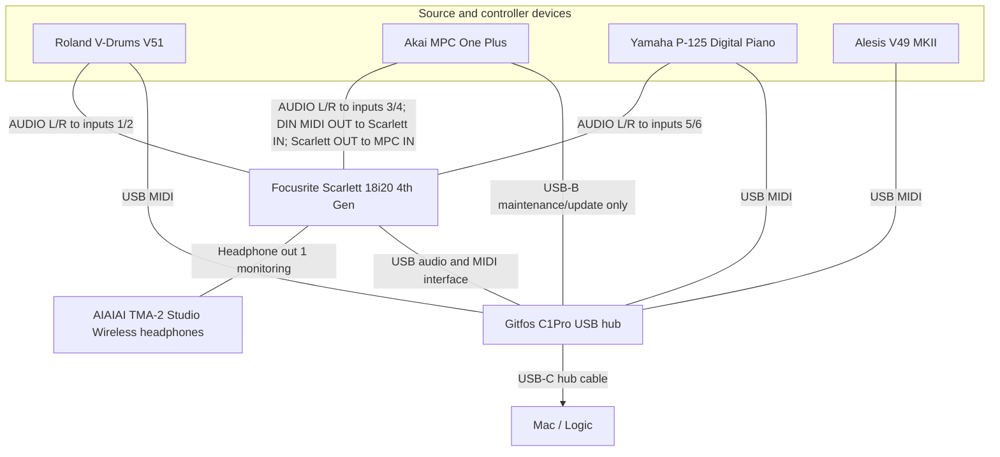
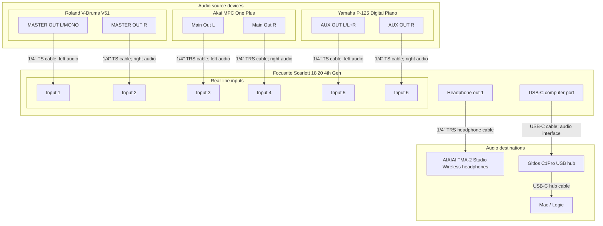
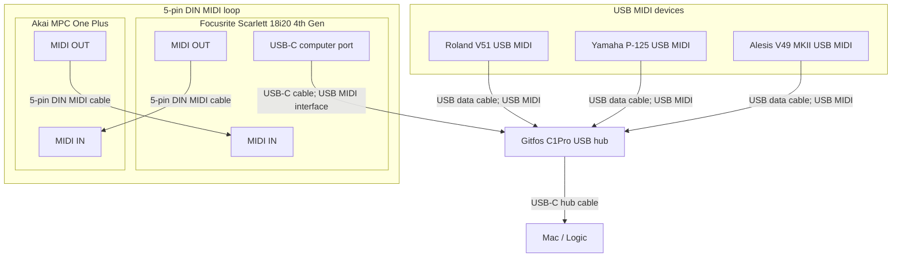

# Music Studio Setup

This file captures the working studio hardware context for future Codex sessions in this folder.

## Documentation Rules

- In detailed Mermaid connection diagrams, every physical cable must have its own line/edge. Do not combine stereo pairs, paired line outputs, or USB chains into a single diagram edge. Topology diagrams are the exception: they may aggregate connection roles into a single device-to-device edge.
- Diagram edge labels must specify the cable type, such as `1/4" TRS cable`, `5-pin DIN MIDI cable`, or `USB-C cable`, rather than generic labels like `audio cable` or `USB cable`.
- Internal device routing may be shown, but it must be labeled as internal routing rather than as a cable.
- Preserve physical device identity in diagrams. Do not collapse multiple devices into a generic `Input devices` box just to make layout easier.
- Keep stereo pairs visually grouped within their actual device, but still draw one cable edge per left/right connection.
- Preferred diagram layout: input/source devices on the top row, the primary interface/mixer alone on the middle row, and monitoring/USB/computer destinations on the bottom row.
- If a bidirectional MIDI loop causes Mermaid to make a bad horizontal layout, use an undirected edge for one physical MIDI cable rather than flattening device structure.
- Use `USB MIDI` consistently for USB ports carrying MIDI. Use the cable label to distinguish the physical cable type. Keep non-MIDI USB roles explicit, such as `USB-B maintenance`.

## Device Summary

### Focusrite Scarlett 18i20 4th Gen

- Role: Primary Mac audio and MIDI interface for Logic.
- Folder: `Focusrite Scarlett 18i20 4th Gen`
- Manual: `Focusrite Scarlett 18i20 4th Gen/scarlett_18i20_4th_gen_user_guide_v3_en.pdf`
- Current use: Replaces both the Focusrite Saffire Pro 40 and the Focusrite Scarlett 4i4 as the single active Mac audio/MIDI interface.
- Roland V51 input pair: rear line inputs 1/2.
- MPC input pair: rear line inputs 3/4.
- Yamaha P-125 input pair: rear line inputs 5/6.
- MPC MIDI path: Scarlett 18i20 MIDI OUT to MPC MIDI IN, and MPC MIDI OUT to Scarlett 18i20 MIDI IN.
- Monitoring path: Headphone out 1 feeds the AIAIAI TMA-2 Studio Wireless headphones.
- USB path: Scarlett 18i20 USB-C computer port connects to the Gitfos C1Pro USB-C hub input, then the hub connects to the Mac.
- Important constraint: No Scarlett 18i20 rear line output jacks are currently connected. Audio and MIDI go to the DAW over USB, and local monitoring uses Headphone out 1.
- Notes: Logic should use the Scarlett 18i20 4th Gen as the audio and MIDI device.

### Focusrite Scarlett 4i4

- Role: Superseded Mac audio interface retained for reference.
- Folder: `Focusrite Scarlett 4i4`
- Current use: Replaced by the Scarlett 18i20 4th Gen.
- Notes: Do not use this as the planned Logic audio device unless intentionally rolling back from the 18i20 setup.

### Focusrite Saffire Pro 40

- Role: Superseded standalone analog line mixer/pass-through device retained for reference.
- Folder: `Focusrite Saffire Pro 40`
- Manual: `Focusrite Saffire Pro 40/userguidepro40english04.pdf`
- Current use: Replaced by the Scarlett 18i20 4th Gen. FireWire is not part of the current setup.
- Important constraint: Do not assume Saffire MixControl, FireWire control, software routing changes, or programmable panning are available.

### Akai MPC One Plus

- Role: Standalone sampler/sequencer/groovebox and stereo audio source.
- Folder: `Akai MPC One Plus`
- Manual: `Akai MPC One Plus/MPC Standalone OS - User Guide - v3.9.pdf`
- Logic MIDI setup note: `Akai MPC One Plus/logic-midi-setup.md`
- Current audio path: MPC main left/right outputs feed Scarlett 18i20 rear line inputs 3/4.
- Cable approach: Use two separate 1/4" TRS cables for stereo, one for left and one for right. Short TS instrument cables can work if needed.
- Current MIDI path: Use the Scarlett 18i20 5-pin DIN MIDI In/Out loop with the MPC One Plus.
- USB maintenance path: MPC USB-B connects to the Gitfos C1Pro USB hub for updates/file maintenance only. Do not treat this USB cable as the active MIDI or audio path.

### Roland V-Drums V51

- Role: Drum sound module, stereo audio source, and USB MIDI source for Logic.
- Folder: `Roland V-Drums V51`
- Main manuals: `Roland V-Drums V51/V51_QuickStart_eng02_W.pdf`, `Roland V-Drums V51/V51_Reference_eng03_W.pdf`, `Roland V-Drums V51/V51_MIDI_Implementation_eng01_W.pdf`
- Current stereo audio path: V51 MASTER OUT L/MONO and R feed Scarlett 18i20 rear line inputs 1/2.
- Current USB MIDI path: V51 USB MIDI connects to the Gitfos C1Pro USB hub, then to the Mac.
- Cable approach: Use two separate 1/4" TS cables for stereo audio, one for left and one for right. Use a USB data cable for USB MIDI.

### Yamaha P-125 Digital Piano

- Role: Digital piano, stereo audio source, and USB MIDI keyboard/controller for Logic.
- Folder: `Yamaha P-125 Digital Piano`
- Main manuals: `Yamaha P-125 Digital Piano/P-125 Owner's Manual.pdf`, `Yamaha P-125 Digital Piano/P-125 P-121 MIDI Reference.pdf`, `Yamaha P-125 Digital Piano/MIDI Basics.pdf`
- Current stereo audio path: Yamaha AUX OUT L/L+R and R feed Scarlett 18i20 rear line inputs 5/6.
- Current USB MIDI path: Yamaha USB MIDI connects to the Gitfos C1Pro USB hub, then to the Mac.
- Cable approach: Use two separate 1/4" TS cables for stereo audio, one for left and one for right. Use a USB data cable for USB MIDI.

### Alesis V49 MKII

- Role: USB MIDI keyboard controller for playing software instruments in Logic.
- Folder: `Alesis V49 MKII`
- Manual: `Alesis V49 MKII/V49 MKII - User Guide - v1.3.pdf`
- Current use: MIDI controller only; it does not provide audio to the Scarlett 18i20 or Logic.
- Current USB MIDI path: Alesis V49 MKII USB MIDI connects to the Gitfos C1Pro USB hub, then to the Mac.
- Cable approach: Use a USB data cable for MIDI only.
- Troubleshooting rule: Verify macOS sees the V49 MKII as a MIDI device before changing Logic track settings.

### Gitfos C1Pro USB Hub

- Role: USB-C hub/dock used for Mac connectivity.
- Folder: `Gitfos C1pro USB hub`
- Current use: Receives USB from the Scarlett 18i20, Roland V51, Alesis V49 MKII, Yamaha P-125, and MPC maintenance path, then passes those connections through to the Mac; also used for general USB/peripheral connectivity.
- Note: For MIDI controllers, a port can provide power while failing data negotiation. If a USB MIDI device lights up but does not appear in macOS, bypass the hub or move to a known-good data port.

### AIAIAI TMA-2 Studio Wireless Headphones

- Role: Wireless monitoring headphones for the current Scarlett 18i20 setup.
- Current path: Scarlett 18i20 Headphone out 1.
- Source note: Identified from the Sweetwater recommendation for AIAIAI TMA-2 Studio Wireless headphones.

## Topology Diagram



## Audio Connections Diagram



## MIDI Connections Diagram



## Current Capture Path

Use this as the first tested path for capturing the current audio/MIDI setup in Logic:

```text
Roland V51 MASTER OUT L/MONO -- 1/4" TS cable -> Scarlett 18i20 rear line input 1
Roland V51 MASTER OUT R -- 1/4" TS cable -> Scarlett 18i20 rear line input 2

MPC One Plus MAIN OUT L -- 1/4" TRS cable -> Scarlett 18i20 rear line input 3
MPC One Plus MAIN OUT R -- 1/4" TRS cable -> Scarlett 18i20 rear line input 4

Yamaha P-125 AUX OUT L/L+R -- 1/4" TS cable -> Scarlett 18i20 rear line input 5
Yamaha P-125 AUX OUT R -- 1/4" TS cable -> Scarlett 18i20 rear line input 6

MPC One Plus MIDI OUT -- 5-pin DIN MIDI cable -> Scarlett 18i20 MIDI IN
Scarlett 18i20 MIDI OUT -- 5-pin DIN MIDI cable -> MPC One Plus MIDI IN

Roland V51 USB MIDI -- USB data cable -> Gitfos C1Pro USB hub -> Mac -> Logic
MPC One Plus USB-B -- USB-B data cable -> Gitfos C1Pro USB hub -> Mac (updates/file maintenance only; not MIDI/audio)
Yamaha P-125 USB MIDI -- USB data cable -> Gitfos C1Pro USB hub -> Mac -> Logic
Alesis V49 MKII USB MIDI -- USB data cable -> Gitfos C1Pro USB hub -> Mac -> Logic

Scarlett 18i20 Headphone out 1 -- 1/4" TRS headphone cable -> AIAIAI TMA-2 Studio Wireless headphones

Scarlett 18i20 USB-C computer port -- USB-C cable -> Gitfos C1Pro USB-C hub input -- USB-C hub cable -> Mac -> Logic

No Scarlett 18i20 rear line output jacks are connected in this setup.
```

## Repository Inventory And Management

### Device Directories

| Directory | Associated device |
| --- | --- |
| [`Akai MPC One Plus`](<Akai MPC One Plus>) | Akai MPC One Plus |
| [`Alesis V49 MKII`](<Alesis V49 MKII>) | Alesis V49 MKII |
| [`Alesis V49 MKII/V49_media`](<Alesis V49 MKII/V49_media>) | Alesis V49 MKII media assets |
| [`Focusrite Saffire Pro 40`](<Focusrite Saffire Pro 40>) | Focusrite Saffire Pro 40, superseded |
| [`Focusrite Scarlett 18i20 4th Gen`](<Focusrite Scarlett 18i20 4th Gen>) | Focusrite Scarlett 18i20 4th Gen |
| [`Focusrite Scarlett 4i4`](<Focusrite Scarlett 4i4>) | Focusrite Scarlett 4i4, superseded |
| [`Gitfos C1pro USB hub`](<Gitfos C1pro USB hub>) | Gitfos C1Pro USB Hub |
| [`Gitfos C1pro USB hub/Gitfos 18 in 1 Powered USB C Hub with 4K HDMI _ C1Pro_files`](<Gitfos C1pro USB hub/Gitfos 18 in 1 Powered USB C Hub with 4K HDMI _ C1Pro_files>) | Gitfos C1Pro saved webpage assets |
| [`Roland V-Drums V51`](<Roland V-Drums V51>) | Roland V-Drums V51 |
| [`Roland V-Drums V51/cloud manager`](<Roland V-Drums V51/cloud manager>) | Roland Cloud Manager installer |
| [`Roland V-Drums V51/driver`](<Roland V-Drums V51/driver>) | Roland V51 Mac driver |
| [`Roland V-Drums V51/system-program`](<Roland V-Drums V51/system-program>) | Roland V51 system program update |
| [`Yamaha P-125 Digital Piano`](<Yamaha P-125 Digital Piano>) | Yamaha P-125 Digital Piano |

### Device Documents And Websites

| Device | Local docs and saved assets | Device website |
| --- | --- | --- |
| Akai MPC One Plus | [`MPC Standalone OS - User Guide - v3.9.pdf`](<Akai MPC One Plus/MPC Standalone OS - User Guide - v3.9.pdf>); [`inMusic Software Center-darwin-universal-1.39.0.zip`](<Akai MPC One Plus/inMusic Software Center-darwin-universal-1.39.0.zip>); [`MPC (Gen 1) 3.9.0 Updater.app.zip`](<Akai MPC One Plus/MPC (Gen 1) 3.9.0 Updater.app.zip>); [`MPC (Gen 2) 3.9.0 Updater.app.zip`](<Akai MPC One Plus/MPC (Gen 2) 3.9.0 Updater.app.zip>) | [Akai MPC One Plus](https://www.akaipro.com/mpc-one-plus/) |
| Alesis V49 MKII | [`V49 MKII - User Guide - v1.3.pdf`](<Alesis V49 MKII/V49 MKII - User Guide - v1.3.pdf>); [`Alesis V Series MKII Preset Editor 1.0.1.dmg.zip`](<Alesis V49 MKII/Alesis V Series MKII Preset Editor 1.0.1.dmg.zip>) | [Alesis V49 MKII](https://www.alesis.com/products/view2/v49-mkii) |
| Focusrite Scarlett 18i20 4th Gen | [`scarlett_18i20_4th_gen_user_guide_v3_en.pdf`](<Focusrite Scarlett 18i20 4th Gen/scarlett_18i20_4th_gen_user_guide_v3_en.pdf>) | [Focusrite Scarlett 18i20 4th Gen](https://us.focusrite.com/products/scarlett-18i20) |
| Focusrite Saffire Pro 40, superseded | [`userguidepro40english04.pdf`](<Focusrite Saffire Pro 40/userguidepro40english04.pdf>); [`Saffire MixControl-3.9.3168_0.dmg.zip`](<Focusrite Saffire Pro 40/Saffire MixControl-3.9.3168_0.dmg.zip>) | [Focusrite Saffire Pro 40](https://focusrite.com/products/saffire-pro-40) |
| Focusrite Scarlett 4i4, superseded | [`Focusrite Control 2 1.1014.0.0.dmg.zip`](<Focusrite Scarlett 4i4/Focusrite Control 2 1.1014.0.0.dmg.zip>) | [Focusrite Scarlett 4i4](https://focusrite.com/products/scarlett-4i4) |
| Gitfos C1Pro USB Hub | [`Gitfos 18 in 1 Powered USB C Hub with 4K HDMI _ C1Pro.html`](<Gitfos C1pro USB hub/Gitfos 18 in 1 Powered USB C Hub with 4K HDMI _ C1Pro.html>) | [Gitfos C1Pro](https://gitfos.com/products/c1pro) |
| Roland V-Drums V51 | [`V51_QuickStart_eng02_W.pdf`](<Roland V-Drums V51/V51_QuickStart_eng02_W.pdf>); [`V51_Reference_eng03_W.pdf`](<Roland V-Drums V51/V51_Reference_eng03_W.pdf>); [`V51_MIDI_Implementation_eng01_W.pdf`](<Roland V-Drums V51/V51_MIDI_Implementation_eng01_W.pdf>); [`V51_DataList_eng02_W.pdf`](<Roland V-Drums V51/V51_DataList_eng02_W.pdf>); [`V51_RCC_SetupGuide_eng01_W.pdf`](<Roland V-Drums V51/V51_RCC_SetupGuide_eng01_W.pdf>); [`V71_V51_V31_RolandCloud_eng02_W.pdf`](<Roland V-Drums V51/V71_V51_V31_RolandCloud_eng02_W.pdf>); [`V-Drums_Play_eng03_W.pdf`](<Roland V-Drums V51/V-Drums_Play_eng03_W.pdf>); [`RolandCloudManager-3-1-23-Universal.dmg`](<Roland V-Drums V51/cloud manager/RolandCloudManager-3-1-23-Universal.dmg>); [`v51_mac13drv_m100.tgz`](<Roland V-Drums V51/driver/v51_mac13drv_m100.tgz>); [`v51_sys_v210.zip`](<Roland V-Drums V51/system-program/v51_sys_v210.zip>) | [Roland V-Drums V51](https://www.roland.com/us/products/v51/) |
| Yamaha P-125 Digital Piano | [`P-125 Owner's Manual.pdf`](<Yamaha P-125 Digital Piano/P-125 Owner's Manual.pdf>); [`P-125 P-121 MIDI Reference.pdf`](<Yamaha P-125 Digital Piano/P-125 P-121 MIDI Reference.pdf>); [`MIDI Basics.pdf`](<Yamaha P-125 Digital Piano/MIDI Basics.pdf>); [`P-125 Quick Operation Guide.pdf`](<Yamaha P-125 Digital Piano/P-125 Quick Operation Guide.pdf>); [`Smart Device Connection Manual for Android.pdf`](<Yamaha P-125 Digital Piano/Smart Device Connection Manual for Android.pdf>) | [Yamaha P-125](https://usa.yamaha.com/products/musical_instruments/pianos/p_series/p-125/index.html) |

### Operational / Repo Discipline

- Keep hardware documentation changes in this repo committed and pushed when done.
- If SSH push fails because the key is not loaded or needs an interactive passphrase, use the authenticated GitHub CLI as the alternate push path. Check `gh auth status`, run `gh auth setup-git` if needed, and push through GitHub CLI-backed HTTPS credentials rather than treating SSH auth as a blocker.
- Before committing, check the diff and avoid committing unrelated local changes.
- Preserve the folder-per-device organization for manuals, installers, saved vendor pages, and supporting assets.
